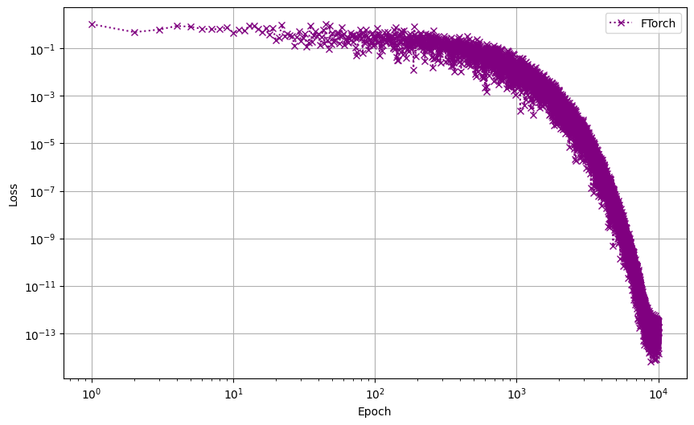

# Example 11 - Training

This example demonstrates training a PyTorch model in Fortran using FTorch.

## Description

The Fortran program in `training.f90` starts with the same SimpleNet model
considered in previous examples, which multiplies each entry of an input tensor
by two. Initially, the weights can be represented by the matrix
```
[2, 0, 0, 0, 0]
[0, 2, 0, 0, 0]
[0, 0, 2, 0, 0]
[0, 0, 0, 2, 0]
[0, 0, 0, 0, 2]
```

A training loop is set up, which retrains the model to permute the input tensor,
shifting each entry along by one and making the final entry become the first.
This can be represented by the weights matrix
```
[0, 0, 0, 0, 1]
[1, 0, 0, 0, 0]
[0, 1, 0, 0, 0]
[0, 0, 1, 0, 0]
[0, 0, 0, 1, 0]
```
In each iteration of the training loop, we generate a random input vector and
apply the permutation to get the expected output.

The stochastic gradient descent (SGD) training loop with learning rate 0.05 is
demonstrated to converge within the 10000 iterations used. The loss trajectory
is stored in a file so that it can be plotted using the `plot.py` Python script.

## Dependencies

To run this example requires:

- CMake
- Fortran compiler
- FTorch (installed as described in main package)
- Python 3

## Running

To run this example, first install FTorch as described in the main
documentation, making use of the `examples` optional dependencies. See the
[user guide section](https://cambridge-iccs.github.io/FTorch/page/installation/general.html#python-dependencies)
on Python dependencies for details.

Compile the Fortran program with (for example)
```
mkdir build
cd build
cmake .. -DCMAKE_PREFIX_PATH=<path/to/your/installation/of/library/> -DCMAKE_BUILD_TYPE=Release
cmake --build .
```

(Note that the Fortran compiler can be chosen explicitly with the
`-DCMAKE_Fortran_COMPILER` flag, and should match the compiler that was used to
locally build FTorch.)

To run the compiled code, simply pass the path to the TorchScript model file
when running the executable on the command line:
```
./training torchscript_simplenet_model_cpu.pt
```
This will output values of interest to screen in the form:
```console
 ================================================
 Epoch:          100

 Input:
 0.3587
 0.6913
 0.1404
 0.2710
 0.0751
[ CPUFloatType{5} ]

 Output:
 0.3260
 0.9769
 0.1344
 0.2568
-0.0484
[ CPUFloatType{5} ]

 loss:
 0.1741
[ CPUFloatType{1} ]

 tensor gradient:
 0.0360  0.0694  0.0141  0.0272  0.0075
 0.0887  0.1709  0.0347  0.0670  0.0186
-0.0799 -0.1540 -0.0313 -0.0604 -0.0167
 0.0167  0.0322  0.0065  0.0126  0.0035
-0.0458 -0.0883 -0.0179 -0.0346 -0.0096
[ CPUFloatType{5,5} ]

 model weights:
 1.4798 -0.1884 -0.1852 -0.1954  0.0112
-0.0176  1.5231 -0.1103 -0.1807 -0.1869
-0.1702  0.0531  1.5182 -0.1288 -0.1550
-0.1308 -0.1738  0.0416  1.5657 -0.1046
-0.1190 -0.1408 -0.1653  0.0244  1.5010
[ CPUFloatType{5,5} ]
...
 ================================================
 Epoch:        10000

 Input:
 0.2955
 0.0360
 0.8094
 0.1236
 0.9795
[ CPUFloatType{5} ]

 Output:
 0.9795
 0.2955
 0.0360
 0.8094
 0.1236
[ CPUFloatType{5} ]

 loss:
1e-13 *
 4.9316
[ CPUFloatType{1} ]

 tensor gradient:
1e-07 *
-1.1273 -0.1371 -3.0876 -0.4715 -3.7367
  0.0705  0.0086  0.1930  0.0295  0.2335
  0.8851  0.1077  2.4243  0.3702  2.9339
 -0.9160 -0.1114 -2.5087 -0.3831 -3.0361
  0.7398  0.0900  2.0262  0.3094  2.4522
[ CPUFloatType{5,5} ]

 model weights:
 3.8326e-07  2.6034e-07  3.4897e-07  3.2039e-07  1.0000e+00
 1.0000e+00  5.0672e-07  2.2984e-07  4.0975e-07  2.5550e-07
 3.8787e-07  1.0000e+00  4.2943e-07  2.6151e-07  2.8689e-07
 2.2633e-07  3.8025e-07  1.0000e+00  3.4166e-07  3.3800e-07
 3.9319e-07  2.7056e-07  2.5957e-07  1.0000e+00  4.6130e-07
[ CPUFloatType{5,5} ]

 Final check after training:
 Input:   1.00000000       2.00000000       3.00000000       4.00000000       5.00000000    
 Output:   4.99999666       1.00000298       2.00000119       2.99999928       3.99999809    
PASSED :: [training] relative tolerance =  0.1000E-02
 Training complete.
 Fortran training example ran successfully
```

## Plotting the loss function convergence

The Fortran program outputs the values of the loss function at each epoch to
file `ftorch_losses.dat`. This can be plotted using the `plot.py` script which
can be run with:
```sh
python3 plot.py
```
This will read the data files and produce a `losses.png` file in the current
directory. The result should look something like



The use of random numbers in the training means that the plot you generate will
likely look slightly different.
