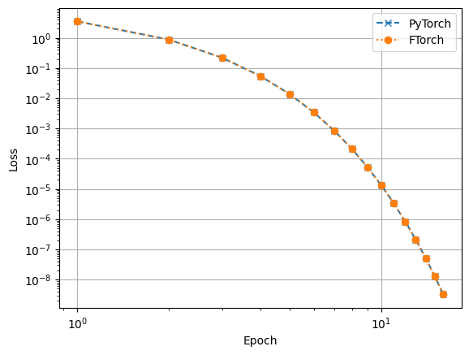

# Example n - Optimizers

**This example is currently under development.** Eventually, it will demonstrate
the use of optimizers in FTorch by leveraging PyTorch's optim module.

By exposing optimizers in Fortran, FTorch will be able to compute optimisation
steps to update models as part of a training process.

## Description

A Python demo is copied from the PyTorch documentation as `optimizers.py`, which
shows how to use an optimiser in PyTorch.

The demo will be replicated in Fortran as `optimizers.f90`, to show how to do the
same thing using FTorch.

## Dependencies

To run this example requires:

- CMake
- Fortran compiler
- FTorch (installed as described in main package)
- Python 3

## Running

To run this example install FTorch as described in the main documentation.
Then from this directory create a virtual environment and install the necessary
Python modules:
```
python3 -m venv venv
source venv/bin/activate
pip install -r requirements.txt
```

Run the Python version of the demo with
```
python3 optimizers.py
```
This trains a tensor to scale, elementwise, a vector of ones to the vector `[1, 2, 3, 4]`.
It uses the torch SGD optimiser to adjust the values of the scaling tensor at each step,
outputting values of interest to screen in the form:
```console
========================
Epoch: 0
        Output:
                tensor([1., 1., 1., 1.], grad_fn=<MulBackward0>)
        loss:
                3.5
        tensor gradient:
                tensor([ 0.0000, -0.5000, -1.0000, -1.5000])
        tensor:
                tensor([1.0000, 1.5000, 2.0000, 2.5000], requires_grad=True)
...
```

To run the Fortran version of the demo we need to compile with (for example)
```
mkdir build
cd build
cmake .. -DCMAKE_PREFIX_PATH=<path/to/your/installation/of/library/> -DCMAKE_BUILD_TYPE=Release
cmake --build .
```

(Note that the Fortran compiler can be chosen explicitly with the `-DCMAKE_Fortran_COMPILER` flag,
and should match the compiler that was used to locally build FTorch.)

To run the compiled code, simply use
```
./optimizers
```
Currently, the example constructs Torch Tensors and iterates over a training loop,
computing a loss with each iteration.
It does not yet implement an optimiser or step to update the scaling tensor.

## Plotting the loss function convergence

The Python and Fortran versions of the demo output the values of the loss
function values at each epoch to files `pytorch_losses.dat` and
`ftorch_losses.dat`, respectively. These can be plotted using the
`plot_losses.py` script, which can be run with:
```sh
python3 plot_losses.py
```
which will read the data files and produce a `losses.png` file in the current
directory. The result should look something like

That is, the loss function convergence behaviour is the same with PyTorch and
FTorch, as we might expect.
