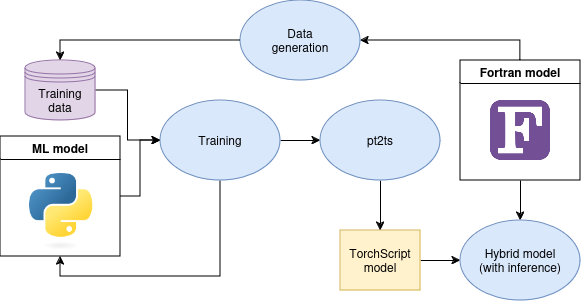

title: Offline training

[TOC]

The established approach for designing and training a model for running
inference in FTorch is the so-called 'offline' approach, which is described in
the following. We are currently working on implementing an alternative online
training approach - see the
[online training user guide page](online.html) for details.

## Workflow

Below we provide a schematic of the offline training workflow, which is broken
down into separate tasks below.

#### 1. Design the ML model in PyTorch

This task is done purely in Python and is not described here. See the
[PyTorch documentation](https://pytorch.org/tutorials/beginner/introyt/modelsyt_tutorial.html) for information on how to do this.

#### 2. Data generation

This task is done purely in Fortran. Run the Fortran model to generate training
data. Depending on how you write the Fortran model output to disk, there may be
some work required to get this training data in an appropriate format for later
reading into Python.

#### 3. Training

This tasks is done purely in Python. Create a Python script that loads the
training data that was saved to disk, splits it into training and validation
sets, runs an optimizer, and then writes the trained model to a file with `.pt`
extension. For more information on how to do this, see the
[PyTorch documentation](https://pytorch.org/tutorials/beginner/introyt/trainingyt.html).

#### 4. pt2ts

Having written a trained model to a file with `.pt` extension, run the
`pt2ts.py` utility Python script to convert it to TorchScript format. A template
`pt2ts.py` script can be found in the
[`utils`](https://github.com/Cambridge-ICCS/FTorch/tree/main/utils)
subdirectory. See the
[README](https://github.com/Cambridge-ICCS/FTorch/blob/main/utils/README.md)
there for more details on how to use the script.

#### 5. Hybrid model

In order to run inference with the trained ML model, you will need to modify
your Fortran model so that it uses FTorch syntax to set up appropriate
`torch_tensor` and `torch_model` objects and call the `torch_tensor_forward`
subroutine to run the inference. For examples of how to do this, see the
[examples user guide page](examples.html).
